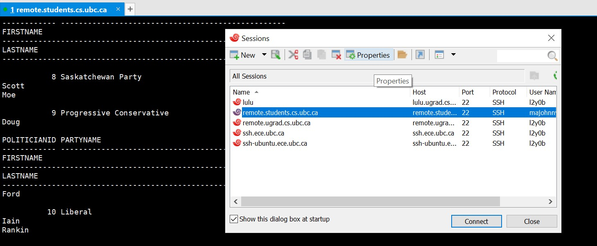
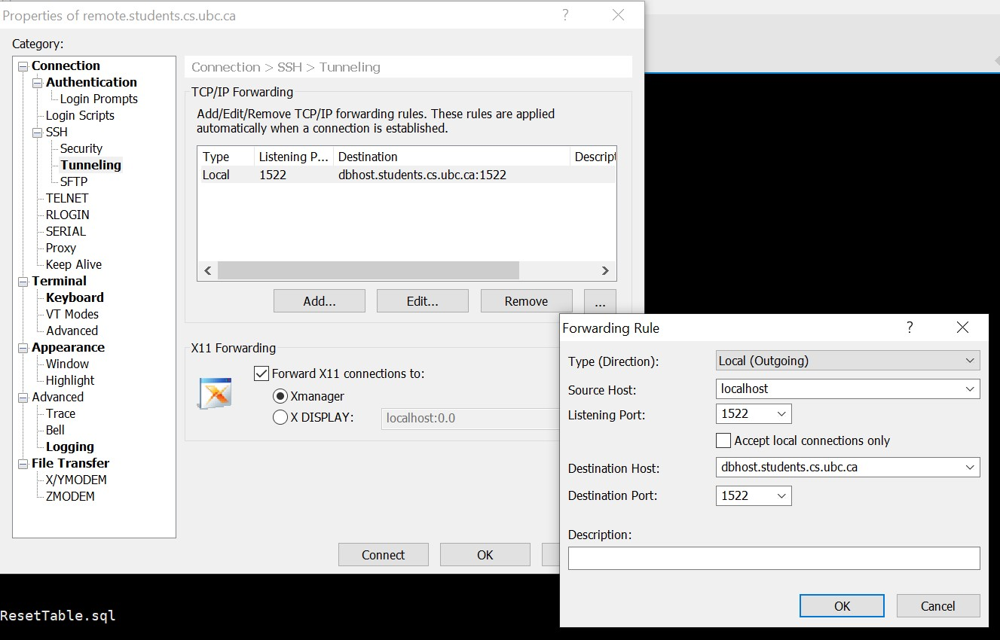

# CPSC304Project_project_e2k1l_l2y0b_u5r2b

## SQL queries Checklist
1. Insertion: add a politician into the politician table (done)
2. Deletion: Delete an article which mentions a Politician (done)
3. Update: Update the Political Leaning score of the party (done)
4. Selection Select all the politicians who belong to Liberal Party (done)
5. Projection: Select the rating, First Name, Last Name of all the politicians (done)
6. Join: Select ArticleURL, Author and Headline of all Articles that mention politician with politicianID 'x'  (done; in /pol/) 
7. Division: Find all the accounts that rate all the politicians (done)
8. Nested Aggregation with Group By: Find all the politicians who have a >= rating compared to the average rating of their party (done)
9. Aggregation with Having 
10. Aggregation with Group By : select politicians with a particular rating and then group by party name (done)

## Installation
### Running the server
1. Install node.js
2. Use npm to install oracledb and express. (nodemon is optional but very useful while coding)
3. Follow https://oracle.github.io/node-oracledb/INSTALL.html#quickstart and install oracle instant client basic: https://www.oracle.com/database/technologies/instant-client.html. If using a mac use commands: 
 
 ```
 mkdir /usr/local/lib 
 
 ln -s ~/Downloads/instantclient_19_8/libclntsh.dylib /usr/local/lib 
 ```
  
 to link the libraries. Note, if you unzipped instantclient in somewhere else, change the second command so that the path be proper. 
 

4. ssh into remote.students.cs.ubc.ca and use SQL*Plus to run siteResetTable.sql (see tutorial 5 for how to do)
5. ssh into remote.students.cs.ubc.ca using xshell (or whatever other tool you want) and create a tunnel from localhost with port 1522 to dbhost.students.cs.ubc.ca port 1522. (see tutorial 6 for how to do)

 
6. In Database.js, change user and password in dbConfig object.
7. Use 'node server.js' or 'npx nodemon server.js' to start server.
8. in browser go to http://localhost:3000/.

Timeline: 

April 1 2020: Project implementation 

Task breakdown:  

Each member will be giving a “page(s)” of the website to work on so that all members will contribute and gain experience on working with the front-end, back-end and database. 

Breakdown of work: (Part 1: Search page, politician page), (Part 2: videos and articles system), (Part 3: Login/account system, comment/rating system). Setup Database with preset data, backend template 

Timeline breakdown: 

By March 19 – database will be setup with some preset data, a template for the backend will be done 

By March 29– Each one of us would have done our part and then we will start testing each other's parts. 

By March 31- We would be done with the testing. 

By April 1- Project will be done 

Assigned Parts: 

Johnny- database with preset data, backend temple, and part 1 

Nero- Login/account system, comment/rating system 

Taqdeer- videos and articles system 

Challenges: 

-Make everything look uniform in front end 

-Three of us will be implementing the same backend file – so we might have troubles in maintaining separate neat and clean code. 

-Time constraint  
